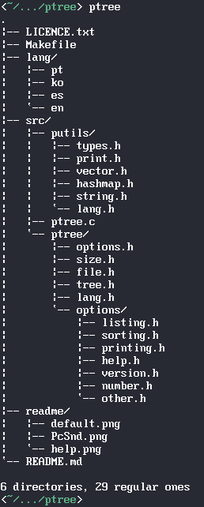
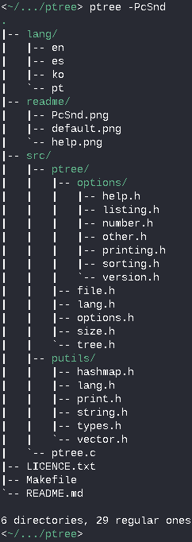

# ptree (pocha-tree)

A simple directory visualizer based on 'tree'.

## Installation

**From source:**

	$ git clone https://github.com/ICanOnlySuffer/ptree/releases/latest
	$ cd ptree
	# make && make install && make clean

**From the AUR:**

	$ git clone https://aur.archlinux.org/ptree
	$ cd ptree
	$ makepkg -sirc

## Uninstallation

**From source:**

	# make uninstall

**With pacman (if installed from the AUR):**

	# pacman -Rcns ptree

## Usage

 

## Contributing

Bug reports, suggestions and pull requests are welcome!

## Languages

Currently available in English, Spanish, Portugese and Korean.

## Licence

This project is available as open source under terms of the
[MIT Licence](https://opensource.org/licenses/MIT).

