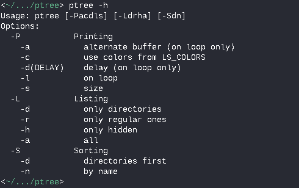
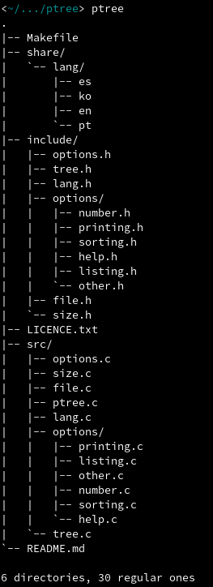
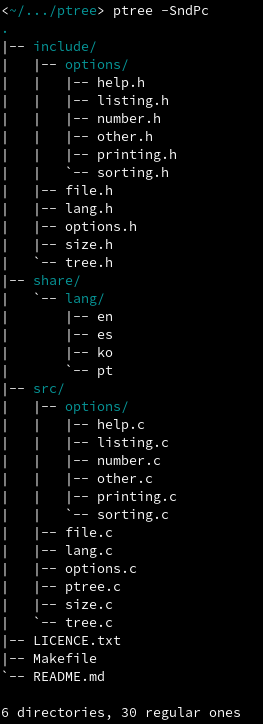

# ptv (pocha's tree visualizer)

A simple directory visualizer based on 'tree'.

## Installation

**From source (requires [pul](https://github.com/ICanOnlySuffer/pul)):**

	$ git clone https://github.com/ICanOnlySuffer/ptv
	# make -C ptv install clean

**From the AUR:**

	$ git clone https://aur.archlinux.org/ptv
	$ cd ptv && makepkg -sirc

## Uninstallation

**From source:**

	# make -C ptv uninstall

**With pacman (if installed from the AUR):**

	# pacman -Rcns ptv

## Usage

 

## Contributing

Bug reports, suggestions and pull requests are welcome!

## Languages

Currently available in English, Spanish and Portugese.

## Licence

This project is available as open source under terms of the
[MIT Licence](https://opensource.org/licenses/MIT).

