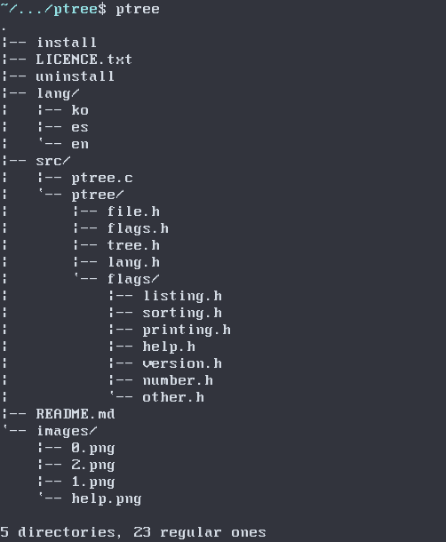
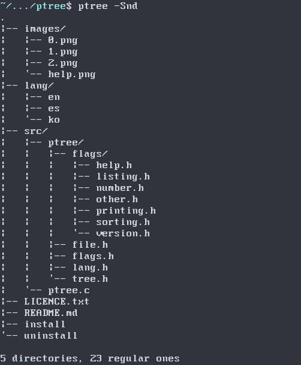
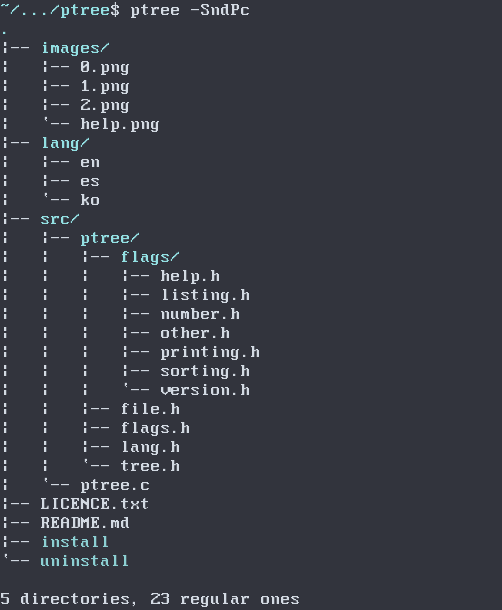

# PTree (pocha-tree)

A simple directory visualizer based on 'tree'.

## Installation

```shell
$ git clone https://github.com/ICanOnlySuffer/ptree
$ cd ptree
# ./install
```

## Uninstallation

```shell
# ./uninstall
```

## Usage


### Examples:







## Contributing

Bug reports, suggestions and pull requests are welcome!

## Licence

This project is available as open source under terms of the [MIT Licence](
	https://opensource.org/licenses/MIT).


