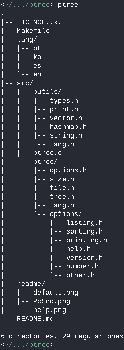

# ptree (pocha-tree)

A simple directory visualizer based on 'tree'.

## Installation

	$ git clone https://github.com/ICanOnlySuffer/ptree
	$ cd ptree
	# make install

## Uninstallation

	# make uninstall

## Usage

 

## Contributing

Bug reports, suggestions and pull requests are welcome!

## Licence

This project is available as open source under terms of the
[MIT Licence](https://opensource.org/licenses/MIT).

